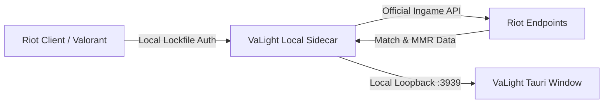

<div align="center">

# ⚡ VaLight Tracker

**A lightweight, private, and bloat-free live match tracker for Valorant.**

[](https://github.com/Aebisc/Valight-Tracker/releases/latest)
[](https://github.com/Aebisc/Valight-Tracker/releases/latest)
[](https://tauri.app)
[](https://nextjs.org)
[](https://www.typescriptlang.org)
[](LICENSE)

<br />

[**Download Latest Release (.exe)**](https://github.com/Aebisc/Valight-Tracker/releases/latest) • [**Features**](#-features) • [**How It Works**](#-how-it-works) • [**Development**](#-development)

</div>

---

## 🚀 Why VaLight?

Most existing Valorant trackers are bloated with invasive overlays, heavy browser runtimes, constant ads, or third-party telemetry. 

**VaLight Tracker** was built from the ground up to be:
- **Lightweight & Fast:** Native desktop shell powered by **Tauri v2** with minimal memory and CPU usage.
- **100% Private & Local:** Directly talks to your local Riot Client loopback API. No logins, no credentials saved, and zero third-party telemetry.
- **Zero Bloat & No Ads:** A clean, distraction-free glassmorphism interface that gives you the exact tactical data you need.
- **Seamless In-App Updates:** Silently checks for releases on startup and updates in one click — no need to redownload installers manually.

---

## ✨ Features

- **🎮 Live Match State Tracking:**
  - Automatic detection for **In-Menus**, **Agent Select (Pregame)**, and **In-Game**.
  - Auto-reconnects seamlessly whenever Valorant launches or restarts.

- **📊 Comprehensive Player Scouting:**
  - Full lobby stats for all 10 players in real time.
  - **Current Rank & RR**, **Peak Rank**, and **Leaderboard Position**.
  - **K/D Ratio**, **Headshot %**, **ACS (Average Combat Score)**, and **ADR (Average Damage / Round)**.
  - **Win Rate**, Account Level, and recent competitive match streak (**W / L / D**).

- **👥 Party Detection:**
  - Instantly identifies who is queued together with color-coded party badges.

- **🎨 Modern Dark UI:**
  - Elegant glassmorphism dark theme designed specifically for multi-monitor setups.
  - Quick-action buttons (copy lobby details, manual refresh).

---

## 📥 Installation

1. Go to the [**Latest Release Page**](https://github.com/Aebisc/Valight-Tracker/releases/latest).
2. Download the installer: **`VaLight.Tracker_1.0.0_x64-setup.exe`** (or newer).
3. Run the installer and launch **VaLight Tracker**.
4. Start Valorant — the tracker will automatically detect the game and start populating live stats!

> **Note:** The built-in auto-updater will automatically notify you whenever new versions are published.

---

## 🔒 Privacy & Safety

- **Read-Only Local API:** Queries the official Riot Client loopback interface (`127.0.0.1`) exposed locally when the Riot Client is open.
- **No Memory Injection / Hooks:** Does not hook into game memory, modify game files, or inject DLLs. It operates completely out-of-process.
- **No Riot Account Credentials Required:** Uses the local session lockfile generated by the official Riot Client on your machine.
- **No Remote Servers:** All match requests stay strictly between your PC and Riot Games.

---

## 🛠️ How It Works



1. **Local Authentication:** Reads the local Riot Client lockfile (`%LOCALAPPDATA%/Riot Games/Riot Client/Config/lockfile`) to authenticate with the local client port.
2. **Region & Session Resolution:** Parses the active game session to identify region, shard, and active match state.
3. **Adaptive Polling:** Pulls live matchmaking data, player PUUIDs, ranks, and historical statistics from Riot's endpoints.
4. **Desktop Presentation:** Renders the data smoothly in a high-performance Tauri native window.

---

## 💻 Development

### Prerequisites
- **Windows 10 / 11**
- **Node.js 18+** ([nodejs.org](https://nodejs.org))
- **Rust & Cargo** ([rustup.rs](https://rustup.rs))
- **Valorant** installed and running on your PC

### Clone & Install
```bash
git clone https://github.com/Aebisc/Valight-Tracker.git
cd Valight-Tracker
npm install
```

### Running Next.js Dev Server (Web Mode)
```bash
npm run dev
```

### Running Native Desktop App (Tauri Mode)
```bash
npx tauri dev
```

### Building the Desktop Installer Locally
```bash
# 1. Prepare Next.js standalone sidecar
npm run prepare:sidecar

# 2. Build desktop installer
npx tauri build
```
The installer will be generated in `src-tauri/target/release/bundle/nsis/`.

---

## 🛠️ Tech Stack

- **Desktop Framework:** [Tauri v2](https://v2.tauri.app) (Rust)
- **Frontend Framework:** [Next.js 16](https://nextjs.org) (App Router, Turbopack)
- **Language:** [TypeScript](https://www.typescriptlang.org) & [Rust](https://www.rust-lang.org)
- **Styling:** [Tailwind CSS](https://tailwindcss.com) + Modern Glassmorphism CSS
- **Data Source:** Local Riot Client API & Valorant-API.com (assets/icons)

---

## 📄 License

Distributed under the **MIT License**. See [`LICENSE`](LICENSE) for more details.

---

<div align="center">
  <sub>VaLight Tracker is not endorsed by Riot Games and does not reflect the views or opinions of Riot Games or anyone officially involved in producing or managing Riot Games properties. Riot Games, and all associated properties are trademarks or registered trademarks of Riot Games, Inc.</sub>
</div>
